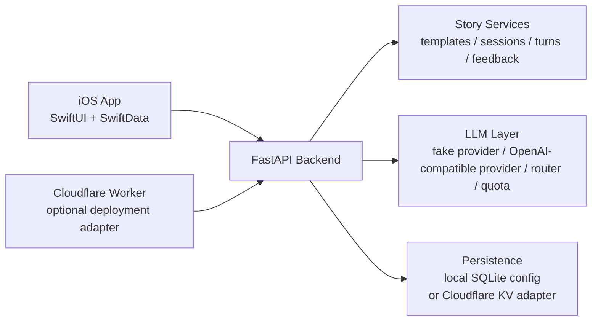

# StoryCat / 故事猫

StoryCat is an AI playable novel MVP by Station Cat.

It combines a FastAPI backend, a SwiftUI iOS app, and an optional Cloudflare Worker deployment path to explore long-form interactive storytelling for Chinese-first readers.

## 中文说明

StoryCat（故事猫）是一个由 Station Cat 打造的 AI 互动小说 MVP 项目。

这个仓库目前包含三部分：

- Python `FastAPI` 后端，用于故事生成、状态推进、接口返回和假数据模式开发
- SwiftUI iOS 客户端，用于模板选择、主角创建、剧情游玩和本地缓存
- 可选的 Cloudflare Worker 部署适配层，用于把同一套后端接口部署到边缘环境

项目当前更偏向一个可运行、可迭代、可继续扩展的原型版本，适合拿来研究：

- AI 互动叙事产品的基础架构
- iOS 客户端与后端 API 的协作方式
- 假数据模式到真实模型接入的演进路径
- 轻量级故事状态管理与多轮剧情推进

## Table of Contents / 目录

- [Highlights / 项目亮点](#highlights--项目亮点)
- [Tech Stack / 技术栈](#tech-stack--技术栈)
- [Architecture / 架构图](#architecture--架构图)
- [Quick Start / 快速开始](#quick-start--快速开始)
- [Run Locally / 本地运行](#run-locally--本地运行)
- [iOS App / iOS 客户端](#ios-app--ios-客户端)
- [Cloudflare Deployment / Cloudflare 部署](#cloudflare-deployment--cloudflare-部署)
- [Security Notes / 安全说明](#security-notes--安全说明)
- [Main Docs / 主要文档](#main-docs--主要文档)

## Highlights / 项目亮点

- AI playable novel flow with story templates, protagonist setup, branching turns, and persistent story state
- FastAPI backend with fake mode enabled by default for safe local development
- SwiftUI iOS client with local cache, anonymous device session bootstrap, and story continuation flow
- Optional Cloudflare Worker adapter for path-prefix deployments

对应中文可以简单理解为：

- 一个可游玩的 AI 小说 MVP 流程
- 一个默认安全、便于本地开发的后端
- 一个能直接跑起来的 SwiftUI iOS 客户端
- 一套可继续接入边缘部署的轻量方案

## Tech Stack / 技术栈

- Backend: Python 3.12+, FastAPI, Pydantic v2
- iOS: SwiftUI, SwiftData, URLSession, Keychain
- Optional deployment: Cloudflare Python Workers + Cloudflare KV

## Architecture / 架构图



中文说明：

- iOS 客户端负责模板选择、角色创建、剧情游玩和本地缓存
- FastAPI 后端负责接口编排、故事状态推进和安全规则处理
- LLM 层支持假数据模式和真实模型接入的演进
- Cloudflare Worker 是可选部署层，不影响本地开发结构

## Repository Layout / 仓库结构

- `app/`: backend API routes, services, schemas, and LLM integration layers
- `ios/`: SwiftUI iOS client
- `tests/`: backend test suite
- `worker.py`: Cloudflare Worker entrypoint for the FastAPI app
- `wrangler.jsonc`: safe deployment template without production identifiers

## Quick Start / 快速开始

Requirements / 环境要求：

- Python 3.12+
- Xcode (only if you want to run the iOS app)
- Node.js (only if you want to use the Cloudflare deployment path)

1. Clone the repository / 克隆仓库
2. Create a Python virtual environment / 创建 Python 虚拟环境
3. Install dependencies / 安装依赖
4. Copy `.env.example` to `.env` / 复制环境变量模板
5. Start the backend / 启动后端

```bash
python3.12 -m venv .venv
source .venv/bin/activate
python -m pip install -e ".[dev]"
cp .env.example .env
```

## Run Locally / 本地运行

Start the backend:

```bash
uvicorn app.main:app --reload
```

健康检查地址：

```text
http://127.0.0.1:8000/health
```

预期返回：

```json
{"status":"ok"}
```

Run tests / 运行测试：

```bash
pytest
```

## iOS App / iOS 客户端

```bash
open ios/PlayableNovel.xcodeproj
```

Command line build / 命令行构建：

```bash
xcodebuild \
  -project ios/PlayableNovel.xcodeproj \
  -scheme PlayableNovel \
  -destination 'platform=iOS Simulator,name=iPhone 17' \
  CODE_SIGNING_ALLOWED=NO \
  build
```

By default, `ios/PlayableNovel/AppConfig.swift` points to the local backend at `http://127.0.0.1:8000`.

中文说明：

- 默认情况下，iOS 客户端会连本地后端
- 如果你已经部署了自己的后端，可以自行修改 `AppConfig.swift` 里的 `backendBaseURL`
- 仓库里不会保存真实 API key，也不建议把密钥写进 iOS 工程

## Cloudflare Deployment / Cloudflare 部署

This repository includes an optional Cloudflare Worker adapter.

中文说明：

- 这部分是可选能力，不是本地开发的前置要求
- 公开仓库中的 `wrangler.jsonc` 已经处理成安全模板
- 你需要自己填写路由、域名、KV namespace 和部署环境变量

Typical flow / 典型流程：

```bash
env PATH="$HOME/Library/Python/3.9/bin:$PATH" UV_PROJECT_ENVIRONMENT=.venv-cloudflare uv run --group cloudflare pywrangler sync
mkdir -p /private/tmp/storycat-worker-deploy
cp -R app worker.py wrangler.jsonc python_modules /private/tmp/storycat-worker-deploy/
npx --yes wrangler@latest deploy --cwd /private/tmp/storycat-worker-deploy
```

## Security Notes / 安全说明

- Keep real provider credentials only in a local ignored `.env`
- Do not store LLM API keys in the iOS project
- Fake mode is the default safe configuration for local development

中文说明：

- 真实模型密钥只放在本地忽略的 `.env` 文件里
- 不要把任何 LLM API key 写进 iOS 客户端
- 这个仓库默认以 fake mode 运行，更适合安全地本地开发和演示

## Main Docs / 主要文档

- `API_CONTRACT.md`
- `ARCHITECTURE.md`
- `DECISIONS.md`
- `ios/README.md`
